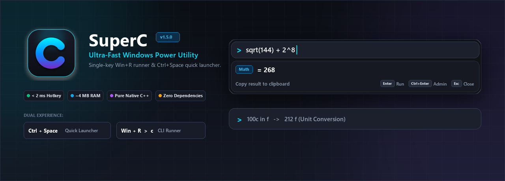
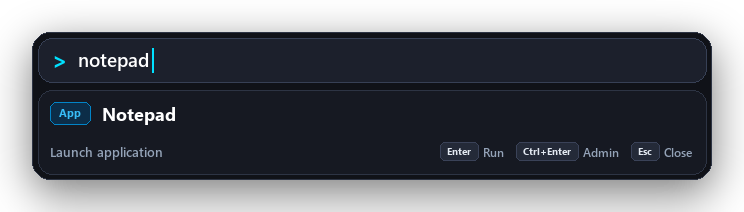
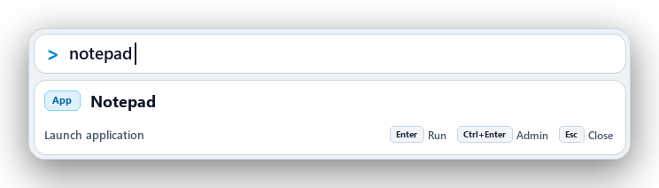
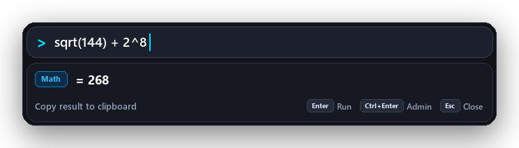
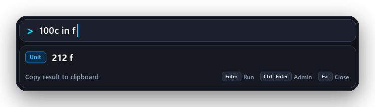
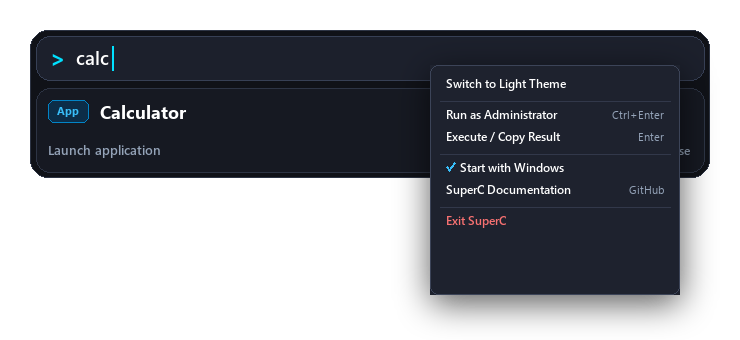

# SuperC - The Ultra-Fast Windows Power Utility & Quick Launcher

<p align="center">
  
</p>

<p align="center">
  <a href="https://github.com/jgera/SuperC/releases/latest"></a>
  <a href="https://github.com/jgera/SuperC/blob/main/LICENSE"></a>
  
  
  
</p>

---

## ⚡ What is SuperC?

**SuperC** is a blazing-fast, lightweight, pure native C++ productivity suite for Windows. It combines two unified experiences powered by the same shared C++ engine:

1. **`SuperC-Launcher.exe` (Floating Quick Launcher)**  
   Press **`Ctrl + Space`** anywhere to summon a modern floating command bar with real-time live preview as you type.
2. **`c.exe` (Windows Run / Command-Line Tool)**  
   Press **`Win + R`** and type `c <anything>` to run commands with interactive terminals, instant calculations, or developer quickies.

---

## 📸 Screenshots & Visual Tour

### 🌓 Dark & Light Themes
Switch seamlessly between Raycast-style obsidian Dark Mode and crisp Light Mode with crystal-clear antialiased typography:

<p align="center">
  
  
</p>

### 🧮 Live Calculations & Offline Unit Conversions
Results compute instantly in real time as you type:

<p align="center">
  
  
</p>

### 🖱️ Right-Click Context Menu
Right-click anywhere on the floating launcher or search bar for instant control:

<p align="center">
  
</p>

---

## 🚀 Why SuperC?

| Feature | SuperC | PowerToys Run / Wox / Flow |
| :--- | :--- | :--- |
| **Language & Runtime** | **Pure Native C++ / Win32** | C# / .NET / WPF / WinUI |
| **Idle Memory Usage** | **~4 MB RAM** | **150 MB – 300 MB RAM** |
| **Hotkey Response Latency** | **< 2 ms** (instant) | 50 – 150 ms (garbage collection lag) |
| **External Dependencies** | **Zero** | .NET Runtime, Desktop SDKs |
| **Dual Interface** | **Floating Bar (`Ctrl+Space`) + Win+R (`c ...`)** | Floating bar only |
| **Startup Overhead** | **Instantaneous** | Background runtime JIT boot |

---

## ⌨️ Quick Start & Usage

### 1. The Quick Launcher (`Ctrl + Space`)
Download and run `SuperC-Launcher.exe`. It quietly docks into your system tray (near the clock).
* Press **`Ctrl + Space`** anywhere on your desktop or inside any application.
* **Minimalist Pill Design:** Initially opens as a compact, floating search pill (~58 px).
* **Multi-Match Dynamic Expansion:** Expands smoothly with clear visual separation between the input bar and the results list, displaying up to **3 matching applications or open windows**!
* **Arrow-Key Navigation:** Use **`↑` / `↓`** arrow keys to cycle through matches with an electric accent indicator, or click any item card directly.
* **Smart App & Doc Filtering:** Automatically filters out clutter (e.g. `.txt`, `.log`, `.md`, manuals, uninstallers, and help links) so only real apps are prioritized.
* **High-Contrast Clarity:** Razor-sharp grayscale antialiased typography in both Dark and Light themes with zero blur or washed-out text.
* **Right-Click Context Menu (Launcher & Tray):** Right-click anywhere on the floating bar, search input, or system tray icon to:
  * 🌓 **Toggle Dark / Light Theme** (persists automatically in registry)
  * 🎯 **Toggle Applications Only (Exclude .txt/docs)** to customize search scope
  * 🛡️ **Run as Administrator** (`Ctrl + Enter`)
  * 📋 **Execute / Copy Result** (`Enter`)
  * 🚀 **Toggle Start with Windows**
  * 📖 Open Documentation & Exit
* **`Enter`**: Executes the currently selected match or copies result to clipboard.
* **`Ctrl + Enter`**: Runs the selected application/command as **Administrator**.
* **`Esc`**: Dismisses the launcher immediately.

### 2. Windows Run Integration (`Win + R`)
Double-click `register.bat` to register `c` into your Windows Run dialog.
* Press **`Win + R`**, type `c 5+7` or `c ipconfig`.
* Math expressions evaluate instantly with zero console flashing and auto-copy to clipboard.
* Terminal commands keep the console open (`cmd /k`) so you can inspect output.

---

## 📖 Feature Matrix & Command Guide

### 1. Live Math & Inline Calculator
Results appear live under the search bar as you type:
* `5+7` $\rightarrow$ `= 12`
* `(100 - 35.5) * 2` $\rightarrow$ Parentheses, decimals, order of operations
* `2^16` $\rightarrow$ Power: `65536`
* `100 * 15%` $\rightarrow$ Percentage calculations: `15`
* `sqrt(144)` $\rightarrow$ Functions: `sqrt`, `cbrt`, `abs`, `round`, `floor`, `ceil`, `sin`, `cos`, `tan`, `log`, `ln`
* `0xFF + 1` $\rightarrow$ Hex arithmetic

### 2. Offline Unit Conversions
Convert measurements instantly without needing the internet or opening a browser:
* `100c in f` $\rightarrow$ `212 f` (Temperature)
* `10km in miles` $\rightarrow$ `6.21371 mi` (Length)
* `1024mb in gb` $\rightarrow$ `1 gb` (Digital Storage)
* `150 lbs to kg` $\rightarrow$ `68.0389 kg` (Weight)
* `24h in days` $\rightarrow$ `1 d` (Time)

### 3. Installed Apps & Window Walker (Task Switcher)
Fast, zero-allocation fuzzy matching across your system:
* **Launch Applications:** Type `notep` (Notepad), `spot` (Spotify), `vsc` (Visual Studio Code), `calc` (Calculator).
* **Switch Open Windows:** Type the title of any open program to bring it directly to the foreground.

### 4. System Power & Control
Execute core Windows system actions right from the keyboard:
* `lock` $\rightarrow$ Locks workstation
* `sleep` $\rightarrow$ Puts PC to sleep
* `restart` / `reboot` $\rightarrow$ Restarts computer
* `shutdown` $\rightarrow$ Shuts down computer
* `empty trash` or `trash` $\rightarrow$ Empties Recycle Bin silently

### 5. Developer & Network Toolkit
* `port 3000` or `port 8080` $\rightarrow$ Detects process name & PID listening on that port, with one-click **Kill Process**.
* `wifi` or `wifi pass` $\rightarrow$ Reveals connected Wi-Fi network and saved security password.
* `pass 16` $\rightarrow$ Generates a cryptographically strong 16-character random password.
* `hex 255` $\rightarrow$ Displays Hex (`0xFF`), Decimal (`255`), and Binary (`0b11111111`).
* `ts 1727940000` $\rightarrow$ Converts Unix epoch timestamp to local date and time.
* `kill node` $\rightarrow$ Force-terminates hung background processes.
* `ip` / `myip` $\rightarrow$ Lists active local IP addresses.

### 6. Quick Web Searches & Direct URLs
* `g <query>` $\rightarrow$ Google search in default browser
* `yt <query>` $\rightarrow$ YouTube search
* `gh <repo>` $\rightarrow$ GitHub repository or search
* `localhost:3000` or `reddit.com` $\rightarrow$ Opens URL directly in browser

---

## 📁 Repository Architecture

```
Super C/
├── assets/                       # High-res GitHub banner and UI previews
│   ├── banner.png                # Hero banner
│   ├── preview-dark.png          # Dark mode preview
│   ├── preview-light.png         # Light mode preview
│   ├── preview-math.png          # Math calculation preview
│   ├── preview-unit.png          # Unit conversion preview
│   └── preview-context-menu.png  # Right-click context menu preview
├── bin/                          # Build output directory
│   ├── c.exe                     # Win+R / CLI executable
│   └── SuperC-Launcher.exe       # Floating Quick Launcher executable
├── releases/                     # Packaged release archives (.zip)
│   ├── SuperC-v1.6.0-windows-x64.zip
│   └── README.md
├── src/
│   ├── common/                   # Shared C++ core engine
│   │   ├── math_eval.h/.cpp      # Recursive descent math parser
│   │   ├── unit_conv.h/.cpp      # Offline unit conversion engine
│   │   ├── app_index.h/.cpp      # Start Menu .lnk scanner & fuzzy matcher
│   │   ├── window_walker.h/.cpp  # Open window switcher (EnumWindows)
│   │   ├── sys_control.h/.cpp    # System power commands (lock, sleep, trash)
│   │   └── handlers.h/.cpp       # Network, port inspector, password gen
│   ├── cli/                      # Win+R / CLI component
│   │   ├── main_cli.cpp          # CLI entry point & command router
│   │   └── ui.h/.cpp             # Win32 result dialogs & clipboard auto-copy
│   ├── launcher/                 # Floating Quick Launcher component
│   │   ├── main_launcher.cpp     # Tray daemon & Ctrl+Space global hotkey
│   │   └── launcher_ui.h/.cpp    # Frameless DWM rounded window & live preview
│   └── resources/                # Assets, resources & build generators
│       ├── app.rc                # Windows resource file
│       ├── app.ico               # Multi-resolution application icon
│       ├── make_icon.py          # Icon generator script
│       └── make_assets.py        # Banner & preview generator script
├── tests/
│   └── test_math.cpp             # Automated unit test suite
├── build.bat                     # One-click MSVC compile script
├── register.bat                  # Registers c.exe in Windows Run (App Paths)
├── unregister.bat                # Unregisters c.exe
├── LICENSE                       # MIT License
└── README.md                     # Documentation
```

---

## 🛠️ Building From Source

### Prerequisites
* Windows 10 or 11 (64-bit)
* Visual Studio 2022 (Community or Build Tools with C++ workload)

### Build Command
Simply execute:
```cmd
build.bat
```
Both `c.exe` and `SuperC-Launcher.exe` will be compiled with embedded resources and copied ready for use.

---

## 📄 License

This project is licensed under the [MIT License](LICENSE).
